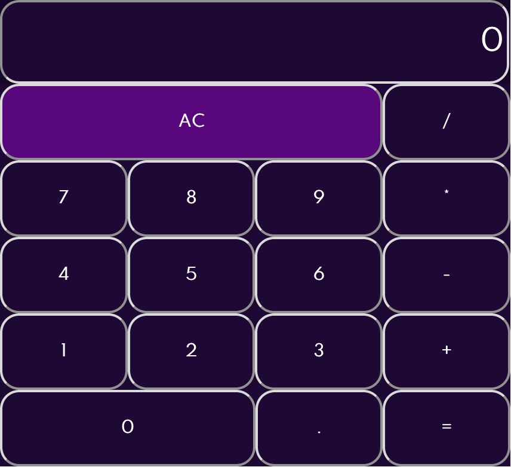

# Calculator APp

This is my first ever project on react. A working calculator. Didnt go all out on the css because I got lazy and dont enjoy css that much.

## Table of contents

[Screenshot](#screenshot)
[Built with](#built-with)

**Note: Delete this note and update the table of contents based on what sections you keep.**

### Screenshot

## My process

### Built with

- Semantic HTML5 markup
- CSS custom properties
- React
- Node.js
- SASS